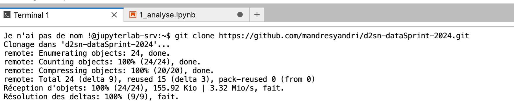

# Data Sprint Campus 2024
Projet d'analyse de données dans le cadre du master Data Science et Société du Numérique. Le projet se porte sur les données ouverts de la SNCF. 

- **Source** : [Le portail open data SNCF](https://datasncf.opendatasoft.com/explore/)
- **Sujet** : Les tarifs SNCF (TGV OUIGO et INOUI)
- **Date** : Du 16 au 20 septembre 2024

## 1 - Cookbook
- [Analyse descriptive des données](1_analyse.ipynb)
- [Pitch projet](https://www.canva.com/design/DAGRGeVyZHY/ybDrSsxFUkfj79s4DYSZFA/edit)
- [Répartition des tâches](https://mandresyandri.notion.site/Data-sprint-campus-2024-10565cc309038070a66af322a9800c30)

## 2 - Travail méthodologie données
- [Augmentation des données : Kilométrage](2_data_augmentation_km.ipynb) **maj 19/09**
- [Augmentation des données : région](2_data_augmentation_regions.ipynb) **maj 19/09**
## 3 - Visualisation
À venir

## Tuto équipe : 
Cloner le code sur le Jupyter Lab dans e-learning. 

Étapes : 
1. Ouvrir le terminal 
2. Copier ce script : 
```bash
git clone https://github.com/mandresyandri/d2sn-dataSprint-2024.git
```



> Rendez-vous sur Moodle
